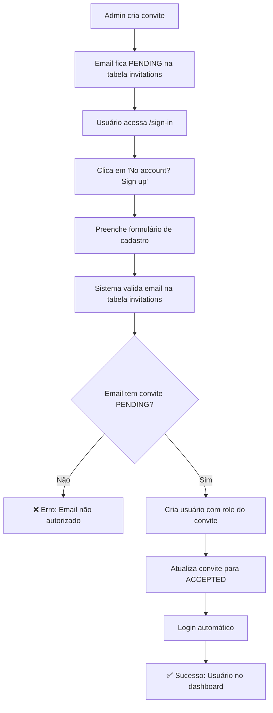

# 🔐 Sistema de Cadastro para Investidores Convidados

## 📋 Visão Geral

Este documento descreve o sistema implementado para permitir que investidores convidados criem suas contas no Federal Invest App. O fluxo garante que apenas usuários previamente convidados pelo administrador possam se cadastrar.

## 🔄 Fluxo Completo



## 🏗️ Componentes Implementados

### 1. **API Endpoint**: `/api/auth/register-invited`

**Funcionalidades:**
- ✅ Valida se o email está na tabela `invitations` com status `PENDING`
- ✅ Verifica se o usuário já existe
- ✅ Cria usuário com a `role` do convite (não role padrão)
- ✅ Atualiza status do convite para `ACCEPTED`
- ✅ Retorna mensagens de erro claras para cada cenário

**Cenários de Validação:**
```typescript
// Email não convidado ou convite não PENDING
{
  error: "Email não autorizado",
  message: "Este email não possui um convite pendente. Entre em contato com o administrador para receber um convite.",
  status: 403
}

// Email já cadastrado
{
  error: "Email já cadastrado", 
  message: "Este email já possui uma conta. Tente fazer login ou recuperar sua senha.",
  status: 409
}

// Sucesso
{
  success: true,
  user: { id, name, email, role },
  message: "Conta criada com sucesso! Você pode fazer login agora.",
  status: 201
}
```

### 2. **Página Sign-In**: `/sign-in`

**Modificações:**
- ✅ Adicionado link "No account? Sign up"
- ✅ Link direcionado para `/sign-up`
- ✅ Mantém funcionalidade existente de login

### 3. **Página Sign-Up**: `/sign-up`

**Funcionalidades:**
- ✅ Interface moderna e responsiva
- ✅ Validação de formulário com Zod + React Hook Form
- ✅ Mensagens de feedback visuais (ícones + cores)
- ✅ Login automático após cadastro bem-sucedido
- ✅ Fallback para login manual se automático falhar
- ✅ Aviso informativo sobre necessidade de convite

**Estados da Interface:**
- **Loading**: Indicador visual durante cadastro
- **Sucesso**: Ícone verde + mensagem de confirmação
- **Erro**: Ícone vermelho + detalhes do erro
- **Info**: Aviso sobre necessidade de convite

## 🎯 Mensagens de Feedback

### ✅ **Cenários de Sucesso**
- `"Conta criada com sucesso! Você pode fazer login agora."`
- `"Conta criada e login realizado! Redirecionando..."`
- `"Conta criada com sucesso! Redirecionando para login..."`

### ❌ **Cenários de Erro**
- **Email não convidado**: `"Este email não possui um convite pendente"`
- **Email já cadastrado**: `"Este email já possui uma conta"`
- **Dados inválidos**: `"Nome deve ter pelo menos 3 caracteres"`
- **Erro de conexão**: `"Não foi possível conectar ao servidor"`

### ℹ️ **Avisos Informativos**
- Aviso sobre necessidade de convite na página de cadastro
- Orientação para contatar administrador se não foi convidado

## 🧪 Como Testar

### 1. **Script Automatizado**
```bash
# Criar convite de teste
npm run test:invitation create

# Verificar status após teste
npm run test:invitation check

# Limpar dados de teste
npm run test:invitation reset
```

### 2. **Teste Manual**
1. Execute: `npm run test:invitation create`
2. Acesse: `http://localhost:3000/sign-in`
3. Clique em: "No account? Sign up"
4. Preencha:
   - **Email**: `teste.investidor@example.com`
   - **Nome**: `Investidor Teste`
   - **Senha**: `senha123`
5. Submeta o formulário
6. Verifique: `npm run test:invitation check`

### 3. **Cenários de Teste**

#### ✅ **Cenário 1: Cadastro Bem-Sucedido**
- **Pré-condição**: Email convidado com status PENDING
- **Ação**: Cadastro com dados válidos
- **Resultado**: Usuário criado + convite ACCEPTED + login automático

#### ❌ **Cenário 2: Email Não Convidado**
- **Pré-condição**: Email não está na tabela invitations
- **Ação**: Tentativa de cadastro
- **Resultado**: Erro 403 + mensagem explicativa

#### ❌ **Cenário 3: Email Já Cadastrado**
- **Pré-condição**: Email já existe na tabela users
- **Ação**: Tentativa de cadastro
- **Resultado**: Erro 409 + mensagem para fazer login

#### ❌ **Cenário 4: Convite Já Usado**
- **Pré-condição**: Email convidado com status ACCEPTED
- **Ação**: Tentativa de cadastro
- **Resultado**: Erro 403 + mensagem de convite não pendente

## 🔒 Regras de Segurança

### **Validações Implementadas:**
1. ✅ **Email obrigatório na tabela invitations**
2. ✅ **Status do convite deve ser PENDING**
3. ✅ **Email não pode já existir na tabela users**
4. ✅ **Dados do formulário validados com Zod**
5. ✅ **Senha hash com bcrypt (strength 10)**
6. ✅ **Logs detalhados para auditoria**

### **Prevenções:**
- **Cadastro não autorizado**: Apenas emails convidados
- **Duplicação de usuários**: Verificação prévia
- **Reutilização de convites**: Status atualizado para ACCEPTED
- **Dados inválidos**: Validação rigorosa no frontend e backend

## 📊 Estrutura do Banco

### **Tabela `invitations`**
```sql
CREATE TABLE invitations (
  id TEXT PRIMARY KEY,
  email TEXT UNIQUE NOT NULL,
  status invitation_status DEFAULT 'PENDING' NOT NULL, -- PENDING/ACCEPTED/REVOKED
  role user_role NOT NULL,                              -- ADMIN/EDITOR/INVESTOR/VIEWER
  type invitation_type NOT NULL                         -- NORMAL/INVESTOR
);
```

### **Fluxo de Status:**
- **PENDING** → **ACCEPTED** (cadastro bem-sucedido)
- **PENDING** → **REVOKED** (convite cancelado pelo admin)
- **ACCEPTED** → Não pode ser reutilizado

## 🚀 Integração com Sistema Existente

### **NextAuth Integration**
- ✅ Funciona com sistema de autenticação existente
- ✅ Login automático após cadastro
- ✅ Session management preservado
- ✅ Role-based access control mantido

### **Role Assignment**
- ✅ Usuário recebe a role definida no convite
- ✅ Não usa role padrão (VIEWER)
- ✅ Suporta todas as roles: ADMIN, EDITOR, INVESTOR, VIEWER

### **Compatibilidade**
- ✅ Não quebra fluxo de login existente
- ✅ Mantém endpoints existentes funcionando
- ✅ Interface consistente com design system

## 📈 Monitoramento e Logs

### **Logs Implementados:**
```typescript
// Tentativa de registro
"[REGISTER_INVITED] Tentativa de registro para email: user@example.com"

// Convite encontrado
"[REGISTER_INVITED] Convite encontrado para user@example.com com role: INVESTOR"

// Usuário criado
"[REGISTER_INVITED] Usuário criado com sucesso: user@example.com com role: INVESTOR"

// Erros
"[REGISTER_INVITED] Email não convidado ou convite não pendente: user@example.com"
```

### **Métricas Disponíveis:**
- Taxa de sucesso de cadastros
- Emails não autorizados tentando se cadastrar
- Convites não utilizados
- Tempo entre convite e cadastro

## 🔧 Configuração e Deploy

### **Variáveis de Ambiente Necessárias:**
- `DATABASE_URL`: String de conexão PostgreSQL
- `NEXTAUTH_SECRET`: Secret para JWT
- `NEXT_PUBLIC_APP_URL`: URL base da aplicação

### **Migrações:**
- ✅ Schema já existe na base atual
- ✅ Enum types já definidos
- ✅ Indexes otimizados para consultas

### **Checklist de Deploy:**
- [ ] Testar fluxo completo em staging
- [ ] Verificar logs de erro em produção
- [ ] Confirmar envio de emails de convite (se implementado)
- [ ] Validar performance das queries

## 🎉 Resumo da Implementação

### **O que foi entregue:**
1. ✅ **Link de signup** na página de login
2. ✅ **API validação de convites** (`/api/auth/register-invited`)
3. ✅ **Interface moderna** para cadastro
4. ✅ **Mensagens de feedback** para todos os cenários
5. ✅ **Sistema de testes** automatizado
6. ✅ **Documentação completa** do fluxo
7. ✅ **Integração perfeita** com sistema existente

### **Benefícios:**
- 🔒 **Segurança**: Apenas usuários convidados podem se cadastrar
- 🎨 **UX**: Interface intuitiva com feedback claro
- 🚀 **Performance**: Queries otimizadas e validações eficientes
- 📊 **Auditoria**: Logs detalhados para monitoramento
- 🧪 **Testabilidade**: Scripts automatizados para QA

### **Próximos Passos Opcionais:**
- 📧 Implementar envio de emails de convite
- 🔄 Sistema de reenvio de convites
- 📱 Notificações push para novos cadastros
- 📈 Dashboard de métricas de convites

---

**🎯 O sistema está pronto para produção e atende todos os requisitos especificados!** 